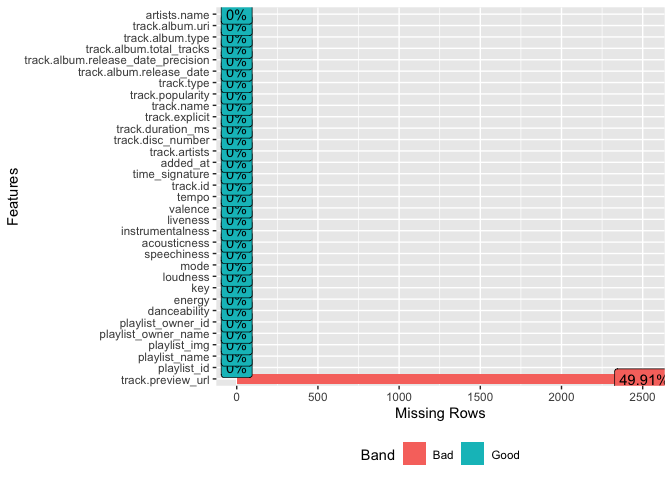

Spotify Top Hits from 1970 to 2019
================

## Overview

The following code is for downloading **audio features** of Spotify’s
“Top Hits of” playlists, specifically from the years 1970 to 2019. For
example the playlist’s title for the year 1990 it would be “Top Hits of
1990”.

It uses the wrapper library
[Spotifyr](https://www.rcharlie.com/spotifyr/) to make http requests to
the Spotify Web API.

### Code

The file `test.R` is an R script for downloading just one playlist, in
order to have an idea of the data shape.

The Rmarkdown file `spotifyHits1970-2019.Rmd` contains the neccesary
code for getting the **audio features** of the Top Hits playlists from
1970-2019. Then it exports the data to the file
`Spotify_TopHits_of_1970_2019.csv`.

## Packages

This packages are required to run the code

``` r
library(spotifyr)
library(dplyr)
library(readr)
library(DataExplorer)
```

## Downloading the data

### Authentication

The Spotifyr’s function `get_spotify_access_token()` gets the **Access
Token** with the Spotify Client ID and the Spotify Client Secret.

``` r
access.token <- get_spotify_access_token(
  client_id = Sys.getenv("SPOTIFY_CLIENT_ID"), 
  client_secret = Sys.getenv("SPOTIFY_CLIENT_SECRET")
)
```

### Playlists IDs

The playlists’ names are like “Top Hits of YYYY”, where YYYY refer to
the year. For example for the year 2000 it would be “Top Hits of 2000”.

The years are in the range \[1970, 2019\], let’s make a vector that
stores the names.

``` r
playlists.names <- paste("Top","Hits", "of", as.character(1970:2019)) 
```

In order to get the ID for each playlist, we can use the
`search_spotify()` function to retrieve info about the playlists

``` r
search.response <- lapply(1:length(playlists.names), function(i) {
  search_spotify(q = playlists.names[i], type = "playlist", 
                 authorization = access.token, 
                 limit = 1)
}
)
```

Let’s extract the IDs from the list response and then verify that the
playlists are the ones created by Spotify

``` r
# get the IDs for the elements in the list using lapply
search.response.ID <- lapply(1:length(search.response), function(i){
   # the i-th playlist tibble in the list
   aux.playlist.info <- search.response[[i]]
   # making sure it's the playlist created by Spotify
   aux.playlist.info <- aux.playlist.info %>% 
     filter(name == playlists.names[i] & owner.display_name == "Spotify")
   # get the actual playlist id from the 4th element of the i-th tibble 
   aux.playlist.info[[4]]
}
)

# convert the IDs to character
playlists.IDs <- as.character(unlist(search.response.ID))
head(playlists.IDs, 10)
```

    ##  [1] "37i9dQZF1DWXQyLTHGuTIz" "37i9dQZF1DX43B4ApmA3Ee" "37i9dQZF1DXaQBa5hAMckp"
    ##  [4] "37i9dQZF1DX2ExTChOnD3g" "37i9dQZF1DWVg6L7Yq13eC" "37i9dQZF1DX3TYyWu8Zk7P"
    ##  [7] "37i9dQZF1DX6rhG68uMHxl" "37i9dQZF1DX26cozX10stk" "37i9dQZF1DX0fr2A59qlzT"
    ## [10] "37i9dQZF1DWZLO9LcfSmxX"

### Getting the playlists’ audio features using their Spotify IDs

Now, let’s use `lapply()` again to get the audio features tibbles in a
list

``` r
features.response <- lapply(1:length(playlists.IDs), function(i) {
  get_playlist_audio_features("Spotify", playlists.IDs[i], 
                 authorization = access.token
                 )
}
)
```

Concatenating the tibbles with `bind_rows`

``` r
playlists.features <- bind_rows(features.response)
```

## Verifying the downloaded data

### Counting

The total instances in the dataset

``` r
nrow(playlists.features)
```

    ## [1] 5030

The numbers of songs in each playlist

``` r
# group by playlist and count
playlists.counts <-  playlists.features %>% group_by(playlist_name) %>% summarise(n = n())
print(playlists.counts, n = nrow(playlists.counts))
```

    ## # A tibble: 51 × 2
    ##    playlist_name        n
    ##    <chr>            <int>
    ##  1 Top Hits of 1970   100
    ##  2 Top Hits of 1971   100
    ##  3 Top Hits of 1972   100
    ##  4 Top Hits of 1973   100
    ##  5 Top Hits of 1974   100
    ##  6 Top Hits of 1975   100
    ##  7 Top Hits of 1976   100
    ##  8 Top Hits of 1977   100
    ##  9 Top Hits of 1978   100
    ## 10 Top Hits of 1979   100
    ## 11 Top Hits of 1980   100
    ## 12 Top Hits of 1981   100
    ## 13 Top Hits of 1982   100
    ## 14 Top Hits of 1983   100
    ## 15 Top Hits of 1984   100
    ## 16 Top Hits of 1985   100
    ## 17 Top Hits of 1986   100
    ## 18 Top Hits of 1987   100
    ## 19 Top Hits of 1988   100
    ## 20 Top Hits of 1989   100
    ## 21 Top Hits of 1990   100
    ## 22 Top Hits of 1991   100
    ## 23 Top Hits of 1992   100
    ## 24 Top Hits of 1993   100
    ## 25 Top Hits of 1994   100
    ## 26 Top Hits of 1995   100
    ## 27 Top Hits of 1996   100
    ## 28 Top Hits of 1997    99
    ## 29 Top Hits of 1998   100
    ## 30 Top Hits of 1999   100
    ## 31 Top Hits of 2000   100
    ## 32 Top Hits of 2001   100
    ## 33 Top Hits of 2002   100
    ## 34 Top Hits of 2003   100
    ## 35 Top Hits of 2004   100
    ## 36 Top Hits of 2005   100
    ## 37 Top Hits of 2006   100
    ## 38 Top Hits of 2007   100
    ## 39 Top Hits of 2008   100
    ## 40 Top Hits of 2009   100
    ## 41 Top Hits of 2010   100
    ## 42 Top Hits of 2011   100
    ## 43 Top Hits of 2012   100
    ## 44 Top Hits of 2013   100
    ## 45 Top Hits of 2014   100
    ## 46 Top Hits of 2015   100
    ## 47 Top Hits of 2016   130
    ## 48 Top Hits of 2017   100
    ## 49 Top Hits of 2018   100
    ## 50 Top Hits of 2019   100
    ## 51 <NA>                 1

### Removing NA row

We can see that there’s one missing value in the `playlist_name` column.
Let’s locate it.

``` r
index.na <- which(is.na(playlists.features$playlist_name))
print(paste("The row of the missing playlist:",index.na))
```

    ## [1] "The row of the missing playlist: 2757"

``` r
print(playlists.features[(index.na-2):(index.na+2), c(2,6:16)])
```

    ## # A tibble: 5 × 12
    ##   playlist_name    danceability energy   key loudness  mode speechiness
    ##   <chr>                   <dbl>  <dbl> <int>    <dbl> <int>       <dbl>
    ## 1 Top Hits of 1997        0.571  0.505     1    -9.31     0      0.0238
    ## 2 Top Hits of 1997        0.745  0.972     6    -5.60     1      0.0316
    ## 3 <NA>                   NA     NA        NA    NA       NA     NA     
    ## 4 Top Hits of 1997        0.581  0.825     4    -9.69     0      0.0373
    ## 5 Top Hits of 1997        0.845  0.884     6    -4.51     0      0.0759
    ## # … with 5 more variables: acousticness <dbl>, instrumentalness <dbl>,
    ## #   liveness <dbl>, valence <dbl>, tempo <dbl>

The missing row belongs to the 1997 playlist, but since all the audio
features are missing let’s remove it.

``` r
playlists.features <- playlists.features[-index.na,]
paste("Number of rows left:",nrow(playlists.features))
```

    ## [1] "Number of rows left: 5029"

``` r
paste("missing values in playlist_name column:" , 
      sum(is.na(playlists.features$playlist_name)))
```

    ## [1] "missing values in playlist_name column: 0"

## Selecting the audio features columns in the data

### Backup

Making a backup for the tibble in an `.rda`file, which can be later
imported into an R session with `readRDS()` function.

``` r
saveRDS(playlists.features, "playlist_features.rds")

rds.output <- "playlist_features.rds"
if (file.exists(rds.output)) {
   print(paste("The file already exists:", rds.output))
} else {
   saveRDS(playlists.features, file = rds.output)
}
```

    ## [1] "The file already exists: playlist_features.rds"

### Columns

Now, there may be more missing values in other columns, but before
checking that, let’s select the columns that contain the audio features
fisrt.

It’s important to mention that not all the columns are for audio
features, some are for IDs or metadata like links to the playlist’s
cover images that could be useful for a dashboard.

The columns that will be extracted are

``` r
columns.features <- c("playlist_id", "playlist_name", "playlist_img", 
                      "playlist_owner_name", "playlist_owner_id",
                      "danceability", "energy", "key", "loudness", 
                      "mode", "speechiness", "acousticness", "instrumentalness", 
                      "liveness", "valence", "tempo", "track.id",
                      "time_signature", "added_at", "track.artists", 
                      "track.disc_number", "track.duration_ms", "track.explicit",
                      "track.name", "track.popularity",
                      "track.preview_url", "track.type",
                      "track.album.release_date", 
                      "track.album.release_date_precision",
                      "track.album.total_tracks",
                      "track.album.type", "track.album.uri"
                      )
```

Selecting the 32 columns listed above and storing the resulting tibble
in `topHits1970_2019`

``` r
playlists.features.subset <- playlists.features[ ,columns.features]
dim(playlists.features.subset)
```

    ## [1] 5029   32

### Creating a column for the artists’ names

Now, using `glimpse()` to see the data types in the
`playlists.features.subset` tibble

``` r
glimpse(playlists.features.subset)
```

    ## Rows: 5,029
    ## Columns: 32
    ## $ playlist_id                        <chr> "37i9dQZF1DWXQyLTHGuTIz", "37i9dQZF…
    ## $ playlist_name                      <chr> "Top Hits of 1970", "Top Hits of 19…
    ## $ playlist_img                       <chr> "https://i.scdn.co/image/ab67706f00…
    ## $ playlist_owner_name                <chr> "Spotify", "Spotify", "Spotify", "S…
    ## $ playlist_owner_id                  <chr> "spotify", "spotify", "spotify", "s…
    ## $ danceability                       <dbl> 0.443, 0.755, 0.474, 0.598, 0.611, …
    ## $ energy                             <dbl> 0.403, 0.876, 0.473, 0.797, 0.470, …
    ## $ key                                <int> 0, 0, 2, 7, 4, 8, 11, 8, 5, 5, 1, 3…
    ## $ loudness                           <dbl> -8.339, -8.867, -11.454, -6.793, -9…
    ## $ mode                               <int> 1, 1, 1, 1, 1, 1, 0, 1, 1, 1, 1, 1,…
    ## $ speechiness                        <dbl> 0.0322, 0.0362, 0.0601, 0.0332, 0.0…
    ## $ acousticness                       <dbl> 0.631000, 0.357000, 0.545000, 0.042…
    ## $ instrumentalness                   <dbl> 0.00e+00, 5.17e-06, 1.25e-06, 4.07e…
    ## $ liveness                           <dbl> 0.1110, 0.2200, 0.0356, 0.0717, 0.5…
    ## $ valence                            <dbl> 0.410, 0.954, 0.561, 0.622, 0.970, …
    ## $ tempo                              <dbl> 143.462, 102.762, 77.583, 123.566, …
    ## $ track.id                           <chr> "7iN1s7xHE4ifF5povM6A48", "6QhXQOpy…
    ## $ time_signature                     <int> 4, 4, 4, 4, 4, 4, 4, 4, 4, 4, 4, 4,…
    ## $ added_at                           <chr> "2021-01-26T11:30:03Z", "2021-01-26…
    ## $ track.artists                      <list> [<data.frame[1 x 6]>], [<data.fram…
    ## $ track.disc_number                  <int> 1, 1, 3, 1, 1, 1, 1, 1, 1, 1, 1, 1,…
    ## $ track.duration_ms                  <int> 243026, 174826, 199266, 147493, 134…
    ## $ track.explicit                     <lgl> FALSE, FALSE, FALSE, FALSE, FALSE, …
    ## $ track.name                         <chr> "Let It Be - Remastered 2009", "Cec…
    ## $ track.popularity                   <int> 78, 74, 37, 70, 70, 77, 47, 67, 76,…
    ## $ track.preview_url                  <chr> NA, "https://p.scdn.co/mp3-preview/…
    ## $ track.type                         <chr> "track", "track", "track", "track",…
    ## $ track.album.release_date           <chr> "1970-05-08", "1970-01-26", "2014-0…
    ## $ track.album.release_date_precision <chr> "day", "day", "day", "day", "day", …
    ## $ track.album.total_tracks           <int> 12, 11, 87, 14, 12, 12, 120, 12, 12…
    ## $ track.album.type                   <chr> "album", "album", "album", "album",…
    ## $ track.album.uri                    <chr> "spotify:album:0jTGHV5xqHPvEcwL8f6Y…

The `track.artists` column is a list of dataframes, where the artists’
names are other information are stored. Let’s extract those names and
add them to a new column for simplicity in later analysis.

``` r
topHits1970_2019 <- playlists.features.subset %>% 
   mutate(artists.name = lapply(1:nrow(playlists.features.subset), function(i){
      playlists.features.subset$track.artists[[i]][[3]]
   })
   ) %>% 
   mutate(artists.name = as.character(artists.name))
```

### Missing values

Let’s look for missing values one last time before exporting the tibble.

``` r
plot_missing(topHits1970_2019)
```

<!-- -->

The result is that only the column `track.preview_url` has missing
values, the column contains links which open a popup with a 30 sec
preview of the track. As long as the audio features have no missing
values then there’s no problem with this data.

## Exporting the data to .csv

Finally, let’s save the data in a `.csv` file.

``` r
file.output <- "Spotify_TopHits_of_1970_2019.csv"

if (file.exists(file.output)) {
   print(paste("The file already exists:", file.output))
} else {
   write_csv(topHits1970_2019, file = file.output)
}
```

    ## [1] "The file already exists: Spotify_TopHits_of_1970_2019.csv"

So, the file saved has the columns

``` r
glimpse(topHits1970_2019)
```

    ## Rows: 5,029
    ## Columns: 33
    ## $ playlist_id                        <chr> "37i9dQZF1DWXQyLTHGuTIz", "37i9dQZF…
    ## $ playlist_name                      <chr> "Top Hits of 1970", "Top Hits of 19…
    ## $ playlist_img                       <chr> "https://i.scdn.co/image/ab67706f00…
    ## $ playlist_owner_name                <chr> "Spotify", "Spotify", "Spotify", "S…
    ## $ playlist_owner_id                  <chr> "spotify", "spotify", "spotify", "s…
    ## $ danceability                       <dbl> 0.443, 0.755, 0.474, 0.598, 0.611, …
    ## $ energy                             <dbl> 0.403, 0.876, 0.473, 0.797, 0.470, …
    ## $ key                                <int> 0, 0, 2, 7, 4, 8, 11, 8, 5, 5, 1, 3…
    ## $ loudness                           <dbl> -8.339, -8.867, -11.454, -6.793, -9…
    ## $ mode                               <int> 1, 1, 1, 1, 1, 1, 0, 1, 1, 1, 1, 1,…
    ## $ speechiness                        <dbl> 0.0322, 0.0362, 0.0601, 0.0332, 0.0…
    ## $ acousticness                       <dbl> 0.631000, 0.357000, 0.545000, 0.042…
    ## $ instrumentalness                   <dbl> 0.00e+00, 5.17e-06, 1.25e-06, 4.07e…
    ## $ liveness                           <dbl> 0.1110, 0.2200, 0.0356, 0.0717, 0.5…
    ## $ valence                            <dbl> 0.410, 0.954, 0.561, 0.622, 0.970, …
    ## $ tempo                              <dbl> 143.462, 102.762, 77.583, 123.566, …
    ## $ track.id                           <chr> "7iN1s7xHE4ifF5povM6A48", "6QhXQOpy…
    ## $ time_signature                     <int> 4, 4, 4, 4, 4, 4, 4, 4, 4, 4, 4, 4,…
    ## $ added_at                           <chr> "2021-01-26T11:30:03Z", "2021-01-26…
    ## $ track.artists                      <list> [<data.frame[1 x 6]>], [<data.fram…
    ## $ track.disc_number                  <int> 1, 1, 3, 1, 1, 1, 1, 1, 1, 1, 1, 1,…
    ## $ track.duration_ms                  <int> 243026, 174826, 199266, 147493, 134…
    ## $ track.explicit                     <lgl> FALSE, FALSE, FALSE, FALSE, FALSE, …
    ## $ track.name                         <chr> "Let It Be - Remastered 2009", "Cec…
    ## $ track.popularity                   <int> 78, 74, 37, 70, 70, 77, 47, 67, 76,…
    ## $ track.preview_url                  <chr> NA, "https://p.scdn.co/mp3-preview/…
    ## $ track.type                         <chr> "track", "track", "track", "track",…
    ## $ track.album.release_date           <chr> "1970-05-08", "1970-01-26", "2014-0…
    ## $ track.album.release_date_precision <chr> "day", "day", "day", "day", "day", …
    ## $ track.album.total_tracks           <int> 12, 11, 87, 14, 12, 12, 120, 12, 12…
    ## $ track.album.type                   <chr> "album", "album", "album", "album",…
    ## $ track.album.uri                    <chr> "spotify:album:0jTGHV5xqHPvEcwL8f6Y…
    ## $ artists.name                       <chr> "The Beatles", "Simon & Garfunkel",…

**Note:** The column `artists.name` contains strings like
`c("artist 1", "artist 2", "artist 3")` when there are multiple artists.
When there’s only one artist it’s just a string like `artist 1`.
